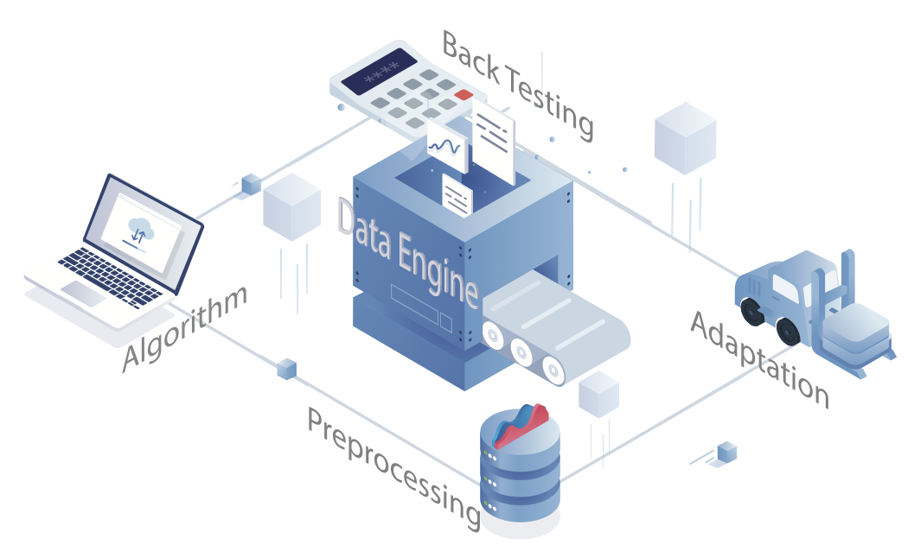

# About

I’m a PhD in Computer Science at Northwestern University, advised by [Prof. Han Liu](https://www.mccormick.northwestern.edu/research-faculty/directory/profiles/liu-han.html). My research focuses on efficiently scaling AI-driven robotics, published at ICRA, ICLR, CVPR, and CoRL. I’ve interned at Meta Reality Lab, Meta’s Ranking & Foundational AI, and Zebra Tech.

I'm broadly interested in robot learning. My research focuses on efficiently scaling AI-driven robotics through computational systems and efficient decision-making. I'm drawn to developing simple, scalable methods that leverage both on-board and distributed compute to accelerate real-world robotic deployment.

[Email](mailto:qinjielin2018@u.northwestern.edu) / 
<!-- <a href="https://github.com/QinjieLin-NU/QinjieLin-NU.github.io/blob/main/assets/data-qinjie/CV_QinjieLin-19.pdf" download="CV_QinjieLin.pdf" style="text-decoration: underline;">CV</a> /  -->
 <a href="assets/data-qinjie/CV_QinjieLin-20_printed.pdf" download="QinjieLin.pdf" style="text-decoration: underline;">CV</a> /
[Google Scholar](https://scholar.google.com/citations?user=yIbFM0EAAAAJ&hl=en) / 
[LinkedIn](https://www.linkedin.com/in/qinjie-lin-bb1512170/) / 
[GitHub](https://github.com/QinjieLin-NU)

<!-- ## News

* [Nov, 2024] Co-organizing the Workshop on Cross-Embodiment Robot Learning at CoRL 2024
* [Oct, 2024] Our work on general-purpose robot foundation model was featured in WIRED, The New York Times, etc. See the paper and blog post for more details
* [Sep, 2024] I started my PhD, supported by Stanford SoE Fellowship
* [May, 2024] One paper is accepted to RSS 2024
* [Mar, 2024] I joined Physical Intelligence (Pi) as the first intern :)
* [Mar, 2024] Media coverage on YAY Robot -->

---

## Publications

**Robotics:** 

1. **ICRA 2024** - DOS®: A Deployment Operating System for Robots  
   Guo Ye, Qinjie Lin, Zening Luo, Han Liu  

2. **ICRA 2023** - EMS®: A Massive Computational Experiment Management System towards Data-driven Robotics  
   Qinjie Lin, Guo Ye, Han Liu  
   <a href="assets/data-qinjie/ICRA2023.pdf" download="EMS_ICRA2023.pdf" style="text-decoration: underline;">paper</a> / [website](https://sites.google.com/view/project-emsr) / [code](https://github.com/emsr-project/emsr_examples) / [video](https://youtu.be/Nd0vzHnERss)

3. **CoRL 2021** - RoboFlow: a Data-centric Workflow Management System for Developing AI-enhanced Robots  
   Qinjie Lin*, Guo Ye*, Jiayi Wang, Han Liu  
   <a href="assets/data-qinjie/2021-CoRL.pdf" download="RoboFlow_CoRL2021.pdf" style="text-decoration: underline;">paper</a> / [website](https://sites.google.com/u.northwestern.edu/roboflow)

4. **Arxiv** - Switch trajectory transformer with distributional value approximation for multi-task reinforcement learning  
   Qinjie Lin, Han Liu, Biswa Sengupta  
   [paper](https://arxiv.org/pdf/2203.07413.pdf)

5. **ICRA 2020** - Collision-free Navigation of Human-centered Robots via Markov Games  
   Guo Ye*, Qinjie Lin*, Tzung-Han Juang, Han Liu  
   <a href="assets/data-qinjie/2020-ICRA.pdf" download="CollisionFreeNavigation_ICRA2020.pdf" style="text-decoration: underline;">paper</a> / [video](https://www.youtube.com/watch?v=lFlo7tiD1fI) / [code](https://github.com/QinjieLin-NU/carl_server)

6. **ICLR 2020** - Learning to Plan in High Dimensions via Neural Exploration-Exploitation Trees  
   Binghong Chen, Bo Dai, Qinjie Lin, Guo Ye, Han Liu, Le Song  
   [arXiv](https://arxiv.org/pdf/1903.00070) / [video](https://www.youtube.com/watch?v=ofg1O8uDHZY) / [code](https://github.com/NeurEXT/NEXT-learning-to-plan/blob/master/main.ipynb)

7. **Project** - JBDL: A JAX-Based Body Dynamics Algorithm Library for Robotics  
   Cheng Zhou, Lei Han, Yuzhu Mao, Guo Ye, Qinjie Lin, Wenbo Ding, Han Liu, Zhaoran Wang, Zhengyou Zhang  
   [github](https://github.com/Tencent-RoboticsX/jbdl)

8. **Working** - DecisionPilot: A Grammar-aware Framework to Enhance LLM-based Embodied Decision Making  
   Qinjie Lin, Han Liu  

**LLM & Foundational Models:**

1. **CVPR 2025** - Free-viewpoint Human Animation with Pose-correlated Reference Selection  
   Fa-Ting Hong, Zhan Xu, Haiyang Liu, Qinjie Lin, Luchuan Song, Zhixin Shu, Yang Zhou, Duygu Ceylan, Dan Xu  

2. **Working** -  A Time Series Foundation Model supporting High-Dimensional Covariates  

3. **Working** - A Time Series Foundational Model for Astrophysics  

4. **Working** - Genomic benchmark

---

# Research {#research}

<!-- ###  Efficient Decision-Making -->

  

    
  

  

    <h2 style="margin-top: 0; font-size: 22px; font-weight: 600;">Collision-free Navigation of Human-centered Robots via Markov Games</h2>
    
Guo Ye*, Qinjie Lin*, Tzung-Han Juang, Han Liu

    
<em>ICRA</em>, 2020

    

      <a href="assets/data-qinjie/2020-ICRA.pdf" style="text-decoration: underline;">paper</a> / 
      <a href="https://www.youtube.com/watch?v=lFlo7tiD1fI" style="text-decoration: underline;">video</a> / 
      <a href="https://github.com/QinjieLin-NU/carl_server" style="text-decoration: underline;">code</a>
    

    
Collision-free navigation for human-centered robots is interesting and we exploit adversarial learning to learn robot collision avoidance policy.

  

  

    
  

  

    <h2 style="margin-top: 0; font-size: 22px; font-weight: 600;">Learning to Plan in High Dimensions via Neural Exploration-Exploitation Trees</h2>
    
Binghong Chen, Bo Dai, Qinjie Lin, Guo Ye, Han Liu, Le Song

    
<em>ICLR</em>, 2020

    

      <a href="https://arxiv.org/pdf/1903.00070" style="text-decoration: underline;">arXiv</a> / 
      <a href="https://www.youtube.com/watch?v=ofg1O8uDHZY" style="text-decoration: underline;">video</a> / 
      <a href="https://github.com/NeurEXT/NEXT-learning-to-plan/blob/master/main.ipynb" style="text-decoration: underline;">code</a>
    

    
Path planning in high dimension is pretty tricky but we propose a meta path planning algorithm to solve planing problems.

  

  

    
  

  

    <h2 style="margin-top: 0; font-size: 22px; font-weight: 600;">JBDL: A JAX-Based Body Dynamics Algorithm Library for Robotics</h2>
    
Cheng Zhou, Lei Han, Yuzhu Mao, Guo Ye, Qinjie Lin, Wenbo Ding, Han Liu, Zhaoran Wang, Zhengyou Zhang

    <!-- 
<em>Working on submission</em>
 -->
    

      <a href="https://github.com/Tencent-RoboticsX/jbdl" style="text-decoration: underline;">github</a>
    

    <!-- 
We develop a JAX-Based body dynamics algorithm library for rigid body dynamics. This library contains a highly efficient python library that contains some essential rigid body dynamics algorithms.
 -->
  

  

    
  

  

    <h2 style="margin-top: 0; font-size: 22px; font-weight: 600;">Switch trajectory transformer with distributional value approximation for multi-task reinforcement learning</h2>
    
Qinjie Lin, Han Liu, Biswa Sengupta

    <!-- 
<em>Submission to ICML</em>, 2023
 -->
    

      <a href="https://arxiv.org/pdf/2203.07413.pdf" style="text-decoration: underline;">paper</a>
    

    <!-- 
We propose SwitchTT, a multi-task extension to Trajectory Transformer but enhanced with sparsely activated model to reduce computation cost and adopting a distributional trajectory value estimator that improves policy performance.
 -->
  

<!-- ## Scalable Cloud Robotics -->

  

    
  

  

    <h2 style="margin-top: 0; font-size: 22px; font-weight: 600;">EMS®: A Massive Computational Experiment Management System towards Data-driven Robotics</h2>
    
Qinjie Lin, Guo Ye, Han Liu

    
<em>ICRA</em>, 2023

    

      <a href="assets/data-qinjie/ICRA2023.pdf" style="text-decoration: underline;">paper</a> / 
      <a href="https://sites.google.com/view/project-emsr" style="text-decoration: underline;">website</a> /
      <a href="https://github.com/emsr-project/emsr_examples" style="text-decoration: underline;">code</a> / 
      <a href="https://youtu.be/Nd0vzHnERss" style="text-decoration: underline;">video</a>
    

    <!-- 
We propose EMS®, a cloud-enabled massive computational experiment management system supporting high-throughput computational robotics research.
 -->
  

  

    
  

  

    <h2 style="margin-top: 0; font-size: 22px; font-weight: 600;">RoboFlow: a Data-centric Workflow Management System for Developing AI-enhanced Robots</h2>
    
Qinjie Lin*, Guo Ye*, Jiayi Wang, Han Liu

    
<em>CoRL</em>, 2021

    

      <a href="assets/data-qinjie/2021-CoRL.pdf" style="text-decoration: underline;">paper</a> / 
      <a href="https://sites.google.com/u.northwestern.edu/roboflow" style="text-decoration: underline;">website</a>
    

    <!-- 
We propose RoboFlow, a cloud-based workflow management system orchestrating the pipelines of developing AI-enhanced robots.
 -->
  

<!-- ## Others -->

  

    
  

  

    <h2 style="margin-top: 0; font-size: 22px; font-weight: 600;">Tower Stacking on Baxter Robot Arm</h2>
    
Jiarui Li, Qinjie Lin, Shufeng Ren, Patricia Sung, Yuchen Wang

    
<em>Northwestern University ME 495: Embedded Systems in Robotics</em>, fall 2018

    

      <a href="https://github.com/MEShufengRen/stacking_test" style="text-decoration: underline;">project</a> / 
      <a href="https://www.youtube.com/watch?v=SKFFj9aCwcA" style="text-decoration: underline;">video</a> / 
      <a href="https://github.com/MEShufengRen/stacking_test" style="text-decoration: underline;">code</a>
    

    
Using Baxter robot arm to pick different blocks on the table and stack them together.

  

  

    
  

  

    <h2 style="margin-top: 0; font-size: 22px; font-weight: 600;">Evolving Robots for Challenging Environments: Morphology Optimization for Versatile Locomotion</h2>
    
Qinjie Lin

    
<em>Artificial Life Project</em>

    

      <a href="https://github.com/QinjieLin-NU/hw-artificial-life" style="text-decoration: underline;">project</a>
    

    <!-- 
A two-level evolutionary algorithm approach that optimizes both robot morphology and control for versatile locomotion in challenging environments. The project demonstrates how robots can evolve different body shapes to adapt to various terrains like rough surfaces, obstacles, and steps.
 -->
  

---

# Teaching {#teaching}

**Teaching Assistant:**

- **COMP_SCI 348**: Introduction to Artificial Intelligence, Fall 2023
- **COMP_SCI 349**: Introduction to Machine Learning, Winter 2023, 2022
- **COMP_SCI 496**: Advanced Topics on Deep Learning, Winter 2019 